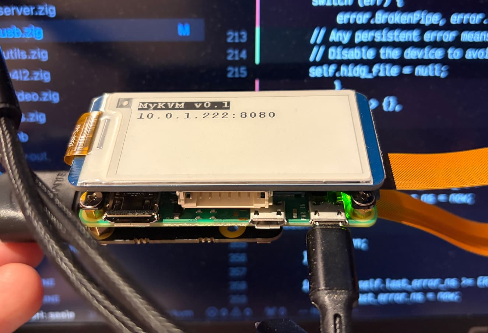
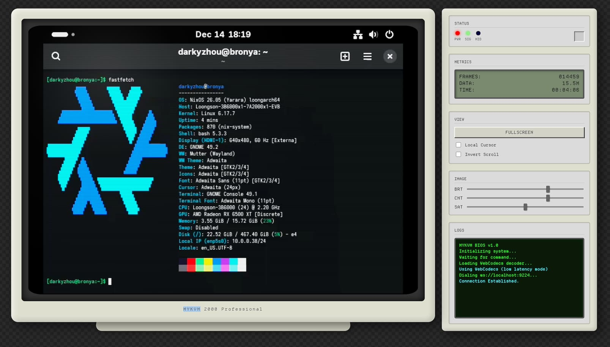

# MyKVM

A KVM-over-IP solution running on Raspberry Pi Zero 2 W, featuring hardware H.264 encoding and a built-in web frontend.

## Features

- **Low Power**: ~1-2W average consumption, powered and controlled through a single USB cable
- **HDMI Capture**: Captures video input via TC358743 HDMI-to-CSI bridge (up to 1080p25)
- **Hardware H.264 Encoding**: Zero-copy encoding using Raspberry Pi's bcm2835-codec with DMABUF
- **USB HID Emulation**: BIOS-compatible keyboard and mouse emulation via USB OTG
- **HTTPS Web Server**: Built-in secure web server with WebSocket for real-time streaming
- **Web Frontend**: Retro CRT-style interface with WebCodecs video decoding
- **E-Paper Display**: Optional status display on 2.13" E-Paper (Waveshare EPD_2in13_V4)

## Images




## Hardware Requirements

- Raspberry Pi Zero 2 W
- TC358743 HDMI-to-CSI bridge module
- USB cable connecting Pi's data port to target machine
- (Optional) Waveshare 2.13" E-Paper display V4

## Prerequisites

### Raspberry Pi Configuration

Add the following to `/boot/firmware/config.txt`:

```
dtparam=spi=on

dtoverlay=dwc2,dr_mode=peripheral

cma=96M
dtoverlay=tc358743
dtoverlay=tc358743-audio
```

### Kernel Modules

```bash
$ sudo modprobe libcomposite
$ sudo nano /boot/firmware/cmdline.txt
# Add to the end of the single line: modules-load=dwc2,libcomposite
```

### Build Dependencies

- [Zig](https://ziglang.org/) 0.15.2 or later
- [pnpm](https://pnpm.io/) (for building the web frontend)

## Building

```bash
$ zig build
```

The binary will be at `zig-out/bin/mykvm`.

## Usage

```
Usage: mykvm --cert <path> --key <path> [options]

Required:
  -c, --cert <path>         TLS certificate path
  -k, --key <path>          TLS private key path

Options:
  -p, --port <port>         HTTPS server port (default: 8443)
  -l, --listen <address>    Listen address (default: 0.0.0.0)
  -d, --device <path>       Capture device path (default: /dev/video0)
  -e, --encoder <path>      Encoder device path (default: /dev/video11)
  -r, --bitrate <bps>       Encoder bitrate (default: 1000000)
  --no-epaper               Disable e-Paper display
  -h, --help                Show help information
```

### Examples

```bash
# Basic usage with self-signed certificate
$ mykvm --cert cert.pem --key key.pem

# Custom port
$ mykvm --cert cert.pem --key key.pem --port 443

# Higher bitrate for better quality
$ mykvm --cert cert.pem --key key.pem --bitrate 2000000
```

### Generating a Self-Signed Certificate

```bash
$ openssl req -x509 -newkey rsa:4096 -keyout key.pem -out cert.pem -days 365 -nodes
```

## Architecture

```
┌─────────────┐    HDMI    ┌───────────┐    CSI    ┌─────────────┐
│   Target    │───────────▶│  TC358743 │──────────▶│   Pi Zero   │
│   Machine   │            └───────────┘           │      2W     │
└─────────────┘                                    └──────┬──────┘
       ▲                                                  │
       │ USB HID                                          │ HTTPS/WS
       │                                                  ▼
┌──────┴──────┐                                    ┌─────────────┐
│  USB OTG    │◀───────────────────────────────────│   Browser   │
│  (Keyboard  │                                    │  (WebCodecs)│
│   + Mouse)  │                                    └─────────────┘
└─────────────┘
```

### Video Pipeline

The video pipeline uses zero-copy DMABUF buffers shared between V4L2 capture and the hardware H.264 encoder:

1. TC358743 captures HDMI → `/dev/video0` (V4L2 capture)
2. Frames passed via DMABUF to bcm2835-codec → `/dev/video11` (V4L2 M2M encoder)
3. H.264 stream sent to browser via WebSocket
4. Browser decodes using WebCodecs (or jMuxer fallback)

### USB HID

USB HID gadget is configured via ConfigFS at runtime:
- `/dev/hidg0`: Boot Protocol keyboard (8-byte reports)
- `/dev/hidg1`: Absolute positioning mouse (6-byte reports)
